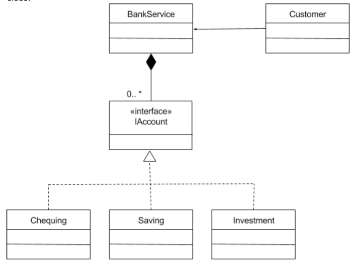

##Facade pattern
Client classes function better with a simpler interaction, however. The façade design pattern attempts to resolve this issue, by providing a single, simplified interface for client classes to interact with a subsystem. It is a structural design pattern.

## Thoughts
If Saving, deposit, functions are the same for different account, should implement in abstract Account class, Not a significant example

